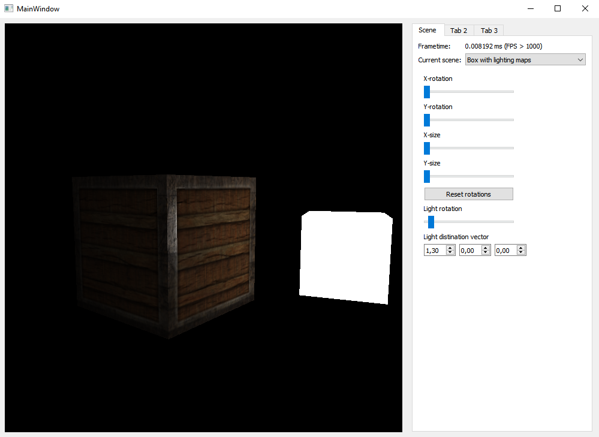

# GraphicsViewerQt

## About

A collection of demonstrative scenes using an OpenGL-based Qt application.

**The project is frozen due to the decision to abandon Qt and make the application full-screen and build an interface based on ImGui.**

**This project is now being developed [here][gv]**

[gv]: <https://github.com/mrjbom/GraphicsViewer>
